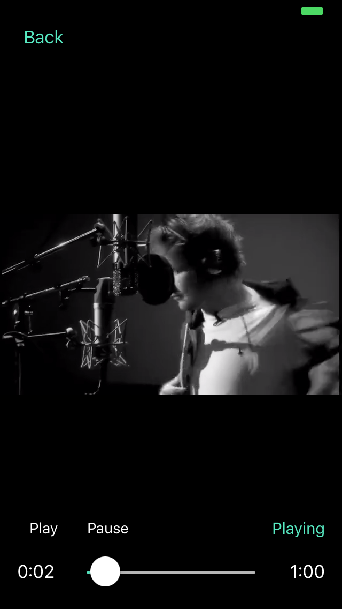

# IRPlayer-swift

### IRPlayer-swift is a powerful video player framework for iOS.

- Use IRPlayer to play video.
    - See demo.
- Use IRPlayer to make video player with custom UI.
    - See [IRPlayerUIShell](https://github.com/irons163/IRPlayerUIShell)
- Use IRPlayer to play IP Camera stream.
    - See [IRIPCamera](https://github.com/irons163/IRIPCamera)
- Use IRPlayer to make Screen Recoder.
    - See [IRRecoder](https://github.com/irons163/IRRecoder)
- Use IRPlayer to make RTMP streaming.
    - See [IRLiveKit](https://github.com/irons163/IRLiveKit)
- Use IRPlayer to make video player with effects .
    - See [IREffectPlayer](https://github.com/irons163/IREffectPlayer)
- Real Live player App.
    - See [IRLive](https://github.com/irons163/IRLive)

## Features

- Support Normal video mode.
- Support VR mode.
- Support VR Box mode.
- Support Fisheye mode.
    - Support Normal Fisheye mode.
    - Support Fisheye to Panorama mode.
    - Support Fisheye to Perspective mode.
- Support multi windows.
- Support multi modes selection.
- Support set the specific renders to each mode.
- Support custom video input(IRFFVideoInput). See what it works in [IRIPCamera](https://github.com/irons163/IRIPCamera).
- Support custom display view(inherit IRGLView). See what it works in [IREffectPlayer](https://github.com/irons163/IREffectPlayer).
- Support SPM.

## Install
### SPM
- Add package: https://github.com/irons163/IRPlayer-swift

## Usage

- more examples in the demo applications.

### Basic

```swift

lazy var player: IRPlayerImp = {
    return IRPlayerImp.player()
}()
    
self.player.registerPlayerNotification(target: self,
                                       stateAction: #selector(stateAction(_:)),
                                       progressAction: #selector(progressAction(_:)),
                                       playableAction: #selector(playableAction(_:)),
                                       errorAction: #selector(errorAction(_:)))
self.player.viewTapAction = { (player, view) in
    print("player display view did click!")
}
if let playerView = self.player.view {
    self.mainView.insertSubview(playerView, at: 0)
}

```

#### Set mode and video source

```swift
switch self.demoType {
case .avPlayerNormal:
    self.player.replaceVideoWithURL(contentURL: PlayerViewController.normalVideo as NSURL)
case .avPlayerVR:
    self.player.replaceVideoWithURL(contentURL: PlayerViewController.vrVideo as NSURL)
case .avPlayerVRBox:
    self.player.displayMode = .box
    self.player.replaceVideoWithURL(contentURL: PlayerViewController.vrVideo as NSURL)
case .ffmpegNormal:
    self.player.decoder.mpeg4Format = .ffmpeg
    self.player.decoder.ffmpegHardwareDecoderEnable = false
    self.player.replaceVideoWithURL(contentURL: PlayerViewController.normalVideo as NSURL)
case .ffmpegNormalHardware:
    self.player.decoder = IRPlayerDecoder.FFmpegDecoder()
    self.player.replaceVideoWithURL(contentURL: PlayerViewController.normalVideo as NSURL)
case .ffmpegFisheyeHardware:
    self.player.decoder = IRPlayerDecoder.FFmpegDecoder()
    self.player.replaceVideoWithURL(contentURL: PlayerViewController.fisheyeVideo as NSURL)
case .ffmpegPanoramaHardware:
    self.player.decoder = IRPlayerDecoder.FFmpegDecoder()
    self.player.replaceVideoWithURL(contentURL: PlayerViewController.fisheyeVideo as NSURL)
case .ffmpegMultiModesHardwareModesSelection:
    self.player.decoder = IRPlayerDecoder.FFmpegDecoder()
    modes = self.createFisheyeModes(with: nil)
    let sharedRender = IRGLRenderNV12()
    for mode in modes ?? [] {
        mode.renderer = sharedRender;
    }
    self.player.renderModes = modes
    self.player.replaceVideoWithURL(contentURL: PlayerViewController.fisheyeVideo as NSURL)
    self.modesButton.isHidden = false
}

```

#### Set custom video source

- See what it works in [IRIPCamera](https://github.com/irons163/IRIPCamera).

``` obj-c
IRFFVideoInput *input = [[IRFFVideoInput alloc] init];
[self.player replaceVideoWithInput:input videoType:IRVideoTypeNormal];

...

IRFFAVYUVVideoFrame * yuvFrame = [[IRFFAVYUVVideoFrame alloc] init];
/*
setup the yuvFrame.
*/
[input updateFrame:frame];
```

### Advanced settings
```swift

NSArray *modes = [self createFisheyeModesWithParameter:nil];
self.player.renderModes = modes;
[self.player replaceVideoWithURL:fisheyeVideo videoType:IRVideoTypeCustom];


func createFisheyeModes(with parameter: IRMediaParameter?) -> [IRGLRenderMode] {
    let normal = IRGLRenderMode2D()
    let fisheye2Pano = IRGLRenderMode2DFisheye2Pano()
    let fisheye = IRGLRenderMode3DFisheye()
    let fisheye4P = IRGLRenderModeMulti4P()
    let modes = [
        fisheye2Pano,
        fisheye,
        fisheye4P,
        normal
    ]

    normal.shiftController.enabled = false
    fisheye2Pano.contentMode = .scaleAspectFill
    fisheye2Pano.wideDegreeX = 360
    fisheye2Pano.wideDegreeY = 20
    fisheye4P.parameter = IRFisheyeParameter(width: 0, height: 0, up: false, rx: 0, ry: 0, cx: 0, cy: 0, latmax: 80)
    fisheye.parameter = fisheye4P.parameter
    fisheye4P.aspect = 16.0 / 9.0
    fisheye.aspect = fisheye4P.aspect

    normal.name = "Rawdata"
    fisheye2Pano.name = "Panorama"
    fisheye.name = "Onelen"
    fisheye4P.name = "Fourlens"

    return modes
}

```

## Screenshots
| Normal | VR |
|:---:|:---:|
|   |    |
| VR Box| Fisheye 360 |
|  |  |
| Panorama| Modes Selection |
|  |  |
| Multi Windows |  |
| |  |


## Credit
##### This project has some basic codes from [SGPlayer](https://github.com/libobjc/SGPlayer).
##### FFMpeg xcframeworks are from [ffmpeg-kit](https://github.com/arthenica/ffmpeg-kit).
